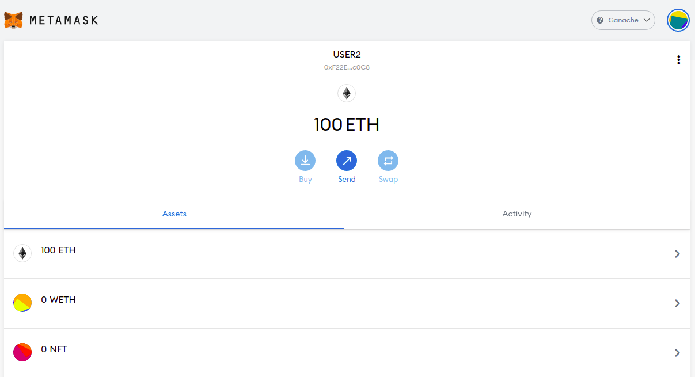

# NFT MarketPalce

```
I have deployed both(ERC20 and NFT) smart contracts and imported in the wallet of different User
You can see the USER1 wallet below
```


``
As you can see it has 100 WETH Tokens(ERC20) and 0 NFT tokens
``

```
Now You can see the Wallet of USER2
```



``
You can see it doesn't have any NFT or ERC20 token
``

```
Now we will create a NFT from the marketplace contract and now the USER2 wallet will have 1 NFT
```


```
USER1 will buy that NFT that is owned by USER2 by giving him ERC20 Tokens i.e WETH
Note- USER1 will have to approve tokens with the MarketPlace smart contract so that it can transfer it on the behalf of USER1

USER1 will buy NFT from the marketplace smart contract and the WETH token will be transfered to the the USER2(owner of NFT) and the NFT will be transfered to the USER1(Owner of WETH Token) 

Asking price for the NFT was 100 WETH
```

`
USER1
`


`
USER2
`
